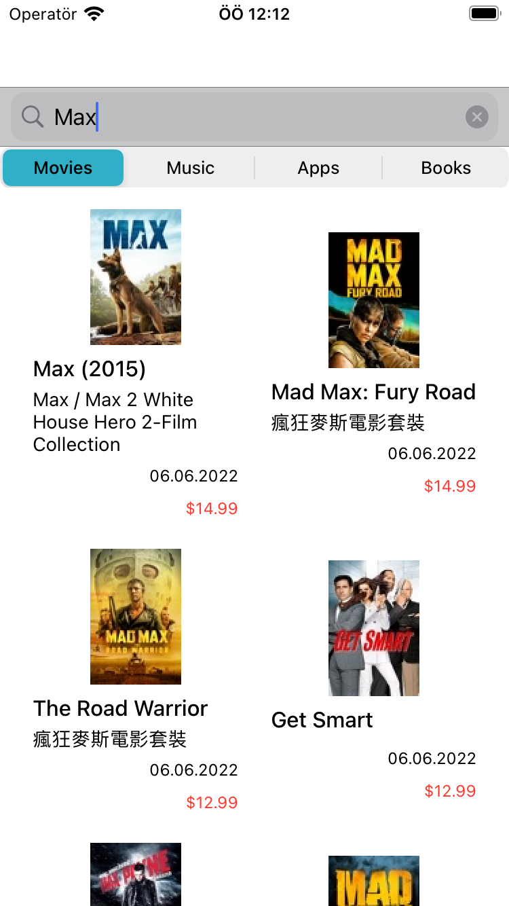
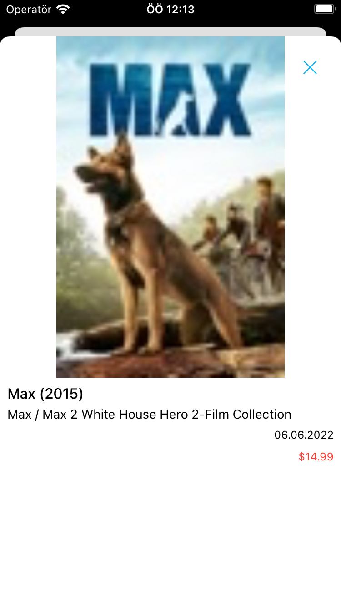

# iTunes-Search
<table>
<tr>
<td align="center">

</td>
<td align="center">

</td align="center">
</tr>
</table>

This project was written with Swift to show Movies, Apps, Musics and Books from iTunes web services.

## Table of Contents
- App Contents
- Architecture
- Dependencies
- Third Party Libraries
- Contributing

## App Contents

This project contains Search screen and Search Entity Detail screen.Also the project contains Unit Tests.
Supports: 15.x and above
Swift: 5.x and above

## Architecture
This project was written VIP(Clean) Architecture pattern.

## Dependencies
Swift Package Manager was used as a package manager in project.

## Third Party Libraries
- Alamofire for networking,
- Kingfisher for media downloading,
were used as libraries for project.

## Contributing
Pull requests are welcome. For major changes, please open an issue first to discuss what you would like to change.

Please make sure to update tests as appropriate.

